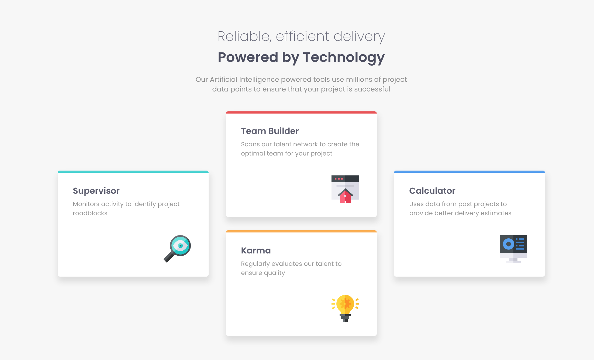
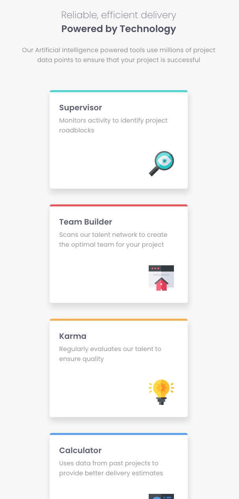

# Frontend Mentor - Four card feature section solution

This is a solution to the [Four card feature section challenge on Frontend Mentor](https://www.frontendmentor.io/challenges/four-card-feature-section-weK1eFYK). Frontend Mentor challenges help you improve your coding skills by building realistic projects. 

## Table of contents

- [Overview](#overview)
  - [The challenge](#the-challenge)
  - [Screenshot](#screenshot)
  - [Links](#links)
- [My process](#my-process)
  - [Built with](#built-with)
  - [What I learned](#what-i-learned)
- [Author](#author)

**Note: Delete this note and update the table of contents based on what sections you keep.**

## Overview

### The challenge

Users should be able to:

- View the optimal layout for the site depending on their device's screen size

### Screenshot

### Links
- Live Site URL: https://nebiyouersabo.github.io/four-card-feature/

## My process

### Built with

- HTML5
- CSS custom properties
- Flexbox
- Mobile First approach

### What I learned
This challenge could've been solved with CSS grid. However, I found it easier to group the middle column and use flexboxes. 

## Author

- Instagrm: www.instagram.com/neba_crown
